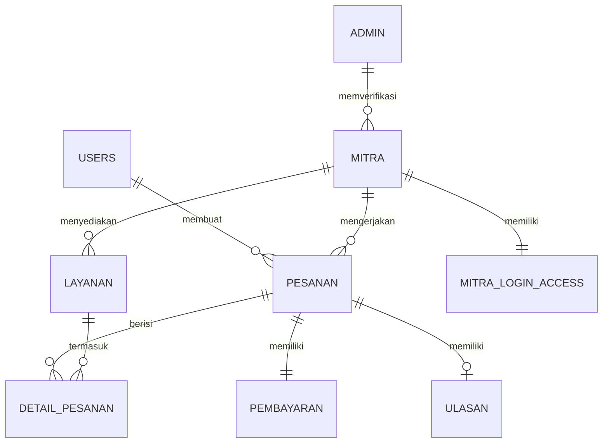

<p align="center">
  
</p>

<h1 align="center">🏠 KostHub</h1>

<p align="center">
  <a href="https://git.io/typing-svg"></a>
</p>

<p align="center">
  <em>Platform layanan harian terintegrasi untuk penghuni kos yang menghubungkan mahasiswa dengan mitra penyedia jasa secara digital, aman, dan transparan.</em>
</p>

<p align="center">
  
  
  
  
  
  
</p>

<p align="center">
  <a href="#-fitur-utama"></a>
  <a href="#%EF%B8%8F-arsitektur"></a>
  <a href="#-quick-start"></a>
  <a href="#-tech-stack"></a>
  <a href="#-dokumentasi"></a>
  <a href="#-tim-pengembang"></a>
</p>

---

## 📋 Tentang Proyek

> **KostHub** adalah platform B2B2C berbasis web yang dirancang untuk memecahkan masalah operasional harian penghuni kos (mahasiswa). 

Platform ini menghubungkan **3 aktor utama** dalam satu ekosistem yang terintegrasi:

- 🧑‍🎓 **Customer** : Penghuni kos yang mencari kemudahan memesan layanan harian (laundry, galon, cleaning).
- 🏪 **Mitra** : Penyedia jasa lokal yang membutuhkan digitalisasi untuk memperluas jangkauan & manajemen pesanan.
- 🛡️ **Admin** : Tim operasional yang menjaga kualitas platform melalui verifikasi mitra & pemantauan transaksi.

<p align="center">
  
</p>

---

## ✨ Fitur Utama

<details>
<summary><strong>🧑‍🎓 Sisi Customer</strong> <em>(Klik untuk melihat)</em></summary>

<br>

- 🔍 **Pencarian & Kategori Layanan** — Filter berdasarkan *Laundry, Gas & Galon, atau Daily Cleaning*.
- 📍 **Location-Based Search** — Temukan mitra terdekat secara akurat via peta interaktif (Leaflet).
- 🛒 **Pemesanan Online** — Formulir pesanan yang lengkap dengan detail lokasi kamar, catatan khusus, hingga foto.
- 💳 **Checkout & Pembayaran** — Fleksibilitas memilih metode *COD* (Cash on Delivery) atau Transfer.
- 📊 **Tracking Status** — Pantau perkembangan pesanan secara *real-time* (Pending → Diproses → Selesai).
- ⭐ **Rating & Ulasan** — Berikan bintang dan komentar terhadap kualitas layanan mitra.
- ❌ **Pembatalan Pesanan** — Opsi pembatalan mudah selama pesanan belum diproses oleh mitra.
- 📜 **Riwayat Pesanan** — Pantau seluruh histori transaksi kamu kapan saja.
</details>

<details>
<summary><strong>🏪 Sisi Mitra (Dashboard)</strong> <em>(Klik untuk melihat)</em></summary>

<br>

- 📦 **Manajemen Pesanan** — Terima, tolak, dan update *progress* pengerjaan dengan satu klik.
- 🧾 **Katalog Layanan** — Fleksibilitas menambah (CRUD) layanan beserta harga, satuan, dan stok.
- 📈 **Keuangan & Transaksi** — Visualisasi ringkasan pendapatan harian/bulanan dan riwayat transaksi.
- 📊 **Inventori Pintar** — Kelola dan pantau pergerakan stok barang agar tidak kehabisan.
- 💬 **Pusat Ulasan** — Baca respons dan *feedback* dari pelanggan untuk meningkatkan kualitas.
</details>

<details>
<summary><strong>🛡️ Sisi Admin (Dashboard)</strong> <em>(Klik untuk melihat)</em></summary>

<br>

- 📊 **Overview & Statistik** — *Bird-eye view* untuk jumlah user aktif, mitra tergabung, dan tren transaksi.
- ✅ **Verifikasi Mitra** — Sistem *approval/rejection* untuk menjamin kredibilitas mitra yang mendaftar.
- 📦 **Global Inventory** — Visibilitas menyeluruh terhadap stok dari seluruh mitra yang beroperasi.
- 🤝 **Partner Management** — Pantau aktivitas dan status *suspend/active* seluruh mitra di platform.
</details>

---

## 🏗️ Arsitektur

Platform KostHub dirancang dengan memisahkan *frontend* dan *backend* (API-Driven Architecture) untuk kemudahan *maintenance*:

```text
┌─────────────────────────────────────────────────────────┐
│                    CLIENT (Browser)                     │
│  ┌───────────────────────────────────────────────────┐  │
│  │         React 19 + Vite 8 + TailwindCSS 4         │  │
│  │  ┌────────────┐  ┌────────────┐  ┌────────────┐   │  │
│  │  │  Customer  │  │   Mitra    │  │   Admin    │   │  │
│  │  │   Pages    │  │ Dashboard  │  │ Dashboard  │   │  │
│  │  └────────────┘  └────────────┘  └────────────┘   │  │
│  └───────────────────────────────────────────────────┘  │
│                           │ Axios                       │
│                           ▼                             │
│  ┌───────────────────────────────────────────────────┐  │
│  │          Vite Dev Proxy (:5173 → :8000)           │  │
│  └───────────────────────────────────────────────────┘  │
└───────────────────────────┬─────────────────────────────┘
                            │ REST API (JSON)
                            ▼
┌─────────────────────────────────────────────────────────┐
│                   SERVER (Laravel 12)                   │
│  ┌───────────────────────────────────────────────────┐  │
│  │              API Routes (/api/v1/*)               │  │
│  │  ┌──────┐   ┌───────┐   ┌───────┐   ┌─────────┐   │  │
│  │  │ Auth │   │ Order │   │ Mitra │   │  Admin  │   │  │
│  │  └──────┘   └───────┘   └───────┘   └─────────┘   │  │
│  ├───────────────────────────────────────────────────┤  │
│  │           Sanctum Token Authentication            │  │
│  ├───────────────────────────────────────────────────┤  │
│  │   Service Layer  →  Eloquent ORM  → SQLite/MySQL  │  │
│  └───────────────────────────────────────────────────┘  │
└─────────────────────────────────────────────────────────┘
```

### 📁 Struktur Proyek

```
praktikum-rpl-A-09/
├── docs/                          # Dokumentasi proyek
│   ├── api/                       # API documentation
│   ├── uml/                       # UML diagrams (use-case, class, sequence)
│   ├── wireframes/                # Wireframes & Figma links
│   ├── erd.png                    # Entity Relationship Diagram
│   ├── srs.md                     # Software Requirements Specification
│   ├── user-stories.md            # User Stories dengan Acceptance Criteria
│   ├── data-dictonary.md          # Data Dictionary (skema database)
│   └── backlog.md                 # Product Backlog (MoSCoW)
│
├── src/
│   ├── backend/                   # Laravel 12 REST API
│   │   ├── app/
│   │   │   ├── Http/Controllers/  # API Controllers (V1)
│   │   │   ├── Models/            # Eloquent Models
│   │   │   ├── Services/          # Business Logic Layer
│   │   │   └── Providers/         # Service Providers
│   │   ├── database/migrations/   # Database schema migrations
│   │   ├── routes/api.php         # API route definitions
│   │   └── config/                # App, CORS, Sanctum config
│   │
│   └── webapp/                    # React 19 SPA (Vite)
│       └── src/
│           ├── features/          # Feature-based modules
│           │   ├── admin/         #   Admin dashboard components
│           │   ├── auth/          #   Login & Register
│           │   ├── landing/       #   Landing page
│           │   ├── location/      #   Map & geolocation
│           │   ├── mitra/         #   Mitra dashboard components
│           │   ├── orders/        #   Order flow & rating
│           │   └── profile/       #   User profile management
│           ├── pages/             # Route page containers
│           ├── components/        # Shared/reusable components
│           ├── context/           # React Context (Auth, Toast, Location)
│           ├── hooks/             # Custom React hooks
│           ├── services/          # API client (Axios)
│           └── utils/             # Utility functions
│
└── README.md
```

---

## 🛠️ Tech Stack

| Layer | Teknologi |
|---|---|
| **Frontend** | React 19, Vite 8, TailwindCSS 4, React Router 7 |
| **Backend** | PHP 8.2+, Laravel 12, Laravel Sanctum 4 |
| **Database** | SQLite (dev) / MySQL (prod) |
| **Maps** | Leaflet + React-Leaflet |
| **Charts** | Recharts |
| **HTTP Client** | Axios |
| **Auth** | Token-based (Laravel Sanctum) |
| **API Pattern** | RESTful API v1 (`/api/v1/*`) |
| **Version Control** | Git & GitHub |
| **Tools Desain** | Figma |
| **Task Management** | ClickUp |

---

## 🚀 Quick Start

### Prasyarat

| Tool | Versi Minimum |
|---|---|
| PHP | 8.2+ |
| Composer | 2.x |
| Node.js | 18+ |
| npm | 9+ |

### 1️⃣ Clone Repository

```bash
git clone https://github.com/muhamadafif87/praktikum-rpl-A-09.git
cd praktikum-rpl-A-09
```

### 2️⃣ Setup Backend (Laravel — Port 8000)

```bash
cd src/backend

# Install PHP dependencies
composer install

# Setup environment
cp .env.example .env
php artisan key:generate

# Setup database (SQLite by default)
php artisan migrate

# Jalankan server
php artisan serve
```

### 3️⃣ Setup Frontend (React — Port 5173)

```bash
cd src/webapp

# Install npm dependencies
npm install

# Setup environment (buat file .env)
echo "VITE_API_URL=http://localhost:8000/api" > .env

# Jalankan development server
npm run dev
```

### 4️⃣ Akses Aplikasi

| Halaman | URL |
|---|---|
| 🌐 Landing Page | `http://localhost:5173` |
| 🔑 Login | `http://localhost:5173/login` |
| 📝 Register | `http://localhost:5173/register` |
| 🏪 Mitra Dashboard | `http://localhost:5173/dashboard/mitra` |
| 🛡️ Admin Dashboard | `http://localhost:5173/dashboard/admin` |
| 📡 API Base | `http://localhost:8000/api/v1` |

---

## 📡 API Overview

API dibangun dengan arsitektur RESTful dan dilindungi oleh **Laravel Sanctum** token authentication.

### Endpoints Utama

```
AUTH
  POST   /api/v1/auth/register          # Registrasi user baru
  POST   /api/v1/auth/login             # Login (User/Mitra/Admin)
  POST   /api/v1/auth/logout            # Logout (auth required)
  GET    /api/v1/auth/me                # Profil user yang login

LANDING PAGE (Public)
  GET    /api/v1/landing-page/statistic          # Statistik platform
  GET    /api/v1/landing-page/laundry-express    # Daftar mitra laundry
  GET    /api/v1/landing-page/galon-gas          # Daftar mitra gas/galon
  GET    /api/v1/landing-page/daily-cleaning     # Daftar mitra cleaning

PESANAN (Customer, auth required)
  POST   /api/v1/landing-page/pesanan            # Buat pesanan baru
  GET    /api/v1/landing-page/pesanan/riwayat    # Riwayat pesanan
  GET    /api/v1/landing-page/pesanan/:id        # Detail pesanan
  PATCH  /api/v1/landing-page/pesanan/:id/cancel # Batalkan pesanan
  POST   /api/v1/landing-page/pesanan/:id/ulasan # Tambah ulasan

MITRA DASHBOARD (Mitra auth required)
  GET    /api/v1/mitra/pesanan                   # Daftar pesanan mitra
  PATCH  /api/v1/mitra/pesanan/:id/status        # Update status pesanan
  GET    /api/v1/mitra/layanan                   # Daftar layanan mitra
  POST   /api/v1/mitra/layanan                   # Tambah layanan baru
  GET    /api/v1/mitra/keuangan/ringkasan        # Ringkasan keuangan
  GET    /api/v1/mitra/ulasan                    # Ulasan dari customer

ADMIN DASHBOARD (Admin auth required)
  GET    /api/v1/dashboard/admin/statistic/summary     # Overview statistik
  GET    /api/v1/dashboard/admin/mitra/list             # Daftar semua mitra
  PATCH  /api/v1/dashboard/admin/mitra/action           # Approve/reject mitra
  GET    /api/v1/dashboard/admin/inventory/list         # Inventori global
```

> 📄 Dokumentasi API lengkap tersedia di folder [`docs/api/`](docs/api/)

---

## 📄 Dokumentasi

| Dokumen | Deskripsi |
|---|---|
| [`docs/srs.md`](docs/srs.md) | Software Requirements Specification |
| [`docs/user-stories.md`](docs/user-stories.md) | User Stories + Acceptance Criteria (Given-When-Then) |
| [`docs/data-dictonary.md`](docs/data-dictonary.md) | Data Dictionary (skema tabel database) |
| [`docs/backlog.md`](docs/backlog.md) | Product Backlog (prioritas MoSCoW) |
| [`docs/team-contract.md`](docs/team-contract.md) | Team Contract & Working Agreement |
| [`docs/erd.png`](docs/erd.png) | Entity Relationship Diagram |
| [`docs/uml/`](docs/uml/) | UML Diagrams (Use Case, Class, Sequence) |
| [`docs/api/`](docs/api/) | API Documentation |

---

## 🗄️ Database Schema

Platform ini menggunakan **8 tabel utama** yang saling terelasi:



---

## 👥 Tim Pengembang

<table width="100%">
  <thead>
    <tr>
      <th align="center" valign="top">👨‍💻 Muhammad Daffa Ade Nugraha<br></th>
      <th align="center" valign="top">🚀 Aerio Ade Putra<br></th>
      <th align="center" valign="top">⚙️ Muhamad Afif Aji Putra<br></th>
      <th align="center" valign="top">🎨 Valentino Joan Cesar<br></th>
    </tr>
  </thead>
  <tbody>
    <tr>
      <td align="center" valign="top">
        <code>[ L0124127 ]</code><br/><br/>
        <em>✨ Lead Software Engineer & Quality Assurance</em>
      </td>
      <td align="center" valign="top">
        <code>[ L0124128 ]</code><br/><br/>
        <em>⚡ Full Stack Developer</em>
      </td>
      <td align="center" valign="top">
        <code>[ L0124134 ]</code><br/><br/>
        <em>🔧 Lead Backend Engineer & System Architect</em>
      </td>
      <td align="center" valign="top">
        <code>[ L0124121 ]</code><br/><br/>
        <em>🖌️ UI/UX Designer & Frontend Engineer</em>
      </td>
    </tr>
  </tbody>
</table>

<p align="center">
  <strong>Praktikum Rekayasa Perangkat Lunak — Kelompok A-09</strong><br/>
  <em>Universitas Sebelas Maret (UNS), Solo</em>
</p>

---

<p align="center">
  Built with ❤️ by <strong>Kelompok A-09-KostHUB</strong> — UNS 2026
</p>
