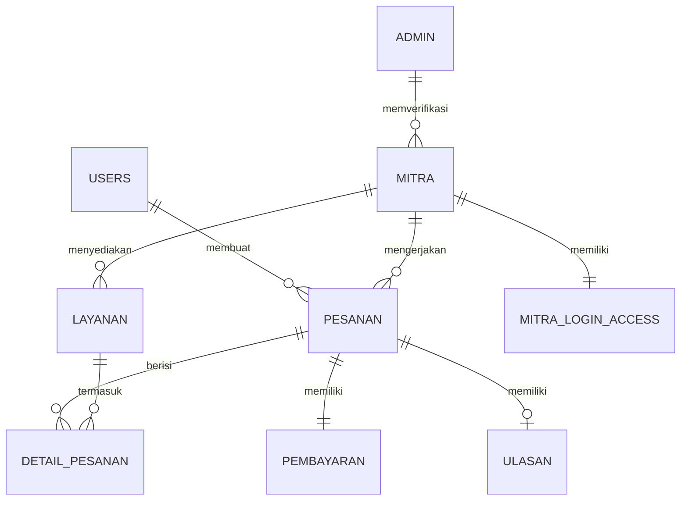

<p align="center">
  
</p>

<h1 align="center">🏠 KostHub</h1>

<p align="center">
  <a href="https://git.io/typing-svg"></a>
</p>

<p align="center">
  <em>Platform layanan harian terintegrasi untuk penghuni kos yang menghubungkan mahasiswa dengan mitra penyedia jasa secara digital, aman, dan transparan. Hadir dalam ekosistem Web App dan Android Mobile App.</em>
</p>

<p align="center">
  
  
  
  
  
  
  
</p>

<p align="center">
  <a href="#-fitur-utama"></a>
  <a href="#%EF%B8%8F-arsitektur"></a>
  <a href="#-quick-start"></a>
  <a href="#-tech-stack"></a>
  <a href="#-dokumentasi"></a>
  <a href="#-tim-pengembang"></a>
</p>

---

## 📋 Tentang Proyek

> **KostHub** adalah platform B2B2C yang dirancang untuk memecahkan masalah operasional harian penghuni kos (mahasiswa). 

Platform ini menghubungkan **3 aktor utama** dalam satu ekosistem *omnichannel* (Web & Mobile) yang terintegrasi:

- 📱 **Customer (Android App & Web)** : Penghuni kos yang mencari kemudahan memesan layanan harian (laundry, galon, cleaning). Disediakan aplikasi **Android khusus** agar pemesanan bisa dilakukan langsung dari genggaman *smartphone*.
- 🏪 **Mitra (Web Dashboard)** : Penyedia jasa lokal yang membutuhkan digitalisasi untuk mengelola pesanan masuk dan manajemen stok.
- 🛡️ **Admin (Web Dashboard)** : Tim operasional yang menjaga kualitas platform melalui verifikasi mitra & pemantauan arus transaksi.

<p align="center">
  
</p>

---

## 🏗️ Arsitektur Sistem

KostHub dibangun menggunakan arsitektur **API-Driven (Headless)**. Satu *backend* API Laravel digunakan bersamaan untuk melayani dua *frontend* yang berbeda (Web dan Android App).

```text
┌─────────────────────────────────────────────────────────┐
│                       CLIENT TIER                       │
│                                                         │
│  ┌────────────────────────┐  ┌───────────────────────┐  │
│  │   WebApp (Browser)     │  │ Android App (Mobile)  │  │
│  │  React 19 + Vite 8     │  │  Kotlin / Compose     │  │
│  │                        │  │                       │  │
│  │ ┌──────┐┌─────┐┌─────┐ │  │ ┌───────────────────┐ │  │
│  │ │ Cust ││Mitra││Admin│ │  │ │   Customer App    │ │  │
│  │ └──────┘└─────┘└─────┘ │  │ └───────────────────┘ │  │
│  └────────────────────────┘  └───────────────────────┘  │
│             │ Axios                     │ Retrofit      │
│             ▼                           ▼               │
└───────────────────────────┬─────────────────────────────┘
                            │ RESTful API (JSON)
                            ▼
┌─────────────────────────────────────────────────────────┐
│                    BACKEND SERVER                       │
│  ┌───────────────────────────────────────────────────┐  │
│  │               Laravel 12 (Port 8000)              │  │
│  │  ┌──────┐   ┌───────┐   ┌───────┐   ┌─────────┐   │  │
│  │  │ Auth │   │ Order │   │ Mitra │   │  Admin  │   │  │
│  │  └──────┘   └───────┘   └───────┘   └─────────┘   │  │
│  ├───────────────────────────────────────────────────┤  │
│  │         Laravel Sanctum Token Authentication      │  │
│  └───────────────────────────────────────────────────┘  │
└─────────────────────────────────────────────────────────┘
```

---

## 🛠️ Tech Stack

| Layer | Teknologi |
|---|---|
| **Frontend Android**| Kotlin, Jetpack Compose / XML, Retrofit (API Client), Google Maps SDK |
| **Frontend Web** | React 19, Vite 8, TailwindCSS 4, React Router 7, Axios, Leaflet |
| **Backend** | PHP 8.2+, Laravel 12, Laravel Sanctum 4 |
| **Database** | SQLite (Dev) / MySQL (Prod) |
| **Auth** | Token-based (Laravel Sanctum) |

---

## 🚀 Quick Start (Menjalankan Proyek)

### Prasyarat
- PHP 8.2+ & Composer 2.x
- Node.js 18+ & npm 9+
- **Android Studio** (Disarankan versi Koala / Ladybug terbaru)

### 1️⃣ Clone Repository

```bash
git clone https://github.com/muhamadafif87/praktikum-rpl-A-09.git
cd praktikum-rpl-A-09
```

### 2️⃣ Setup Backend API (Wajib untuk Web & Android)

**Sangat Penting:** Aplikasi Android tidak akan bisa login atau memuat data jika *backend* ini tidak dijalankan.

```bash
cd src/backend

# Install dependensi
composer install

# Setup env dan database
cp .env.example .env
php artisan key:generate
php artisan migrate

# JALANKAN SERVER API
# Parameter --host=0.0.0.0 wajib agar API bisa ditembak oleh emulator / HP fisik!
php artisan serve --host=0.0.0.0 --port=8000
```

### 3️⃣ Setup Frontend (React Web App)

```bash
# Buka terminal baru
cd src/webapp
npm install

# Setup environment Web
echo "VITE_API_URL=http://localhost:8000/api" > .env

# Jalankan Web App (Akses di http://localhost:5173)
npm run dev
```

### 4️⃣ 📱 Setup Android App (Mobile)

Setelah API berjalan di port 8000, ikuti langkah ini untuk menghubungkan aplikasi Android:

1. Buka **Android Studio**.
2. Pilih **Open an existing project** lalu pilih folder *source code* Android (contoh: `src/android`).
3. Tunggu hingga proses *Gradle Sync* selesai (indikator *loading* di pojok kanan bawah hilang).
4. **Konfigurasi API URL:** Buka file konfigurasi koneksi API (biasanya di `NetworkModule.kt`, `RetrofitClient.kt`, atau `.env`). Ubah variabel `BASE_URL` sesuai dengan *environment testing* kamu:
   - 💻 **Jika pakai Emulator (AVD):**  
     Ubah menjadi: `http://10.0.2.2:8000/api/v1/`  
     *(Emulator membaca localhost dari laptop sebagai 10.0.2.2).*
   - 📱 **Jika pakai HP Fisik:**  
     Pastikan HP & Laptop terhubung di WiFi/Hotspot yang sama. Cek IP Address IPv4 laptopmu (lewat CMD `ipconfig` atau Terminal `ifconfig`). Contoh IP kamu `192.168.1.5`, maka ubah menjadi:  
     `http://192.168.1.5:8000/api/v1/`
5. Tekan tombol **Run (▶)** atau `Shift + F10` untuk menginstal dan menjalankan aplikasi ke HP/Emulator.

---

## ✨ Fitur Utama

<details>
<summary><strong>🧑‍🎓 Sisi Customer (Aplikasi Android & Web)</strong> <em>(Klik untuk melihat)</em></summary>

- 🔍 **Pencarian & Kategori Layanan** — Filter *Laundry, Gas & Galon, atau Daily Cleaning*.
- 📍 **Location-Based Search** — Temukan mitra terdekat secara akurat via Google Maps SDK.
- 🛒 **Pemesanan Mudah** — Detail lokasi kamar, catatan, hingga foto terintegrasi dari kamera HP.
- 💳 **Metode Pembayaran** — *COD* (Cash on Delivery) atau Transfer.
- 📊 **Live Tracking** — Pantau perkembangan pesanan (Pending → Diproses → Selesai).
- ⭐ **Rating & Ulasan** — Berikan *feedback* untuk layanan mitra.
</details>

<details>
<summary><strong>🏪 Sisi Mitra (Web Dashboard)</strong> <em>(Klik untuk melihat)</em></summary>

- 📦 **Manajemen Pesanan Masuk** — Terima/tolak pesanan dari user Android.
- 🧾 **Katalog & Harga** — Atur daftar layanan, harga, satuan, dan ketersediaan.
- 📈 **Keuangan** — Pantau ringkasan pendapatan harian/bulanan.
</details>

<details>
<summary><strong>🛡️ Sisi Admin (Web Dashboard)</strong> <em>(Klik untuk melihat)</em></summary>

- 📊 **Statistik Global** — *Overview* seluruh user aktif dan total transaksi.
- ✅ **Verifikasi Mitra** — Proses *approval/rejection* pendaftar baru.
- 🤝 **Partner Management** — Manajemen status aktif/suspend seluruh mitra.
</details>

---

## 📡 API Overview (Endpoints)

REST API digunakan sebagai pusat data yang menghubungkan Web dan Mobile App. 

```text
AUTH
  POST   /api/v1/auth/register          # Registrasi user baru
  POST   /api/v1/auth/login             # Login (Menghasilkan Sanctum Token)
  POST   /api/v1/auth/logout            # Logout
  GET    /api/v1/auth/me                # Ambil profil user aktif

CUSTOMER (Mobile / Web)
  GET    /api/v1/landing-page/laundry-express    # Daftar mitra laundry
  GET    /api/v1/landing-page/galon-gas          # Daftar mitra gas/galon
  POST   /api/v1/landing-page/pesanan            # Buat pesanan baru
  GET    /api/v1/landing-page/pesanan/riwayat    # Riwayat pesanan

MITRA DASHBOARD (Web)
  GET    /api/v1/mitra/pesanan                   # Daftar antrian pesanan
  PATCH  /api/v1/mitra/pesanan/:id/status        # Update status pesanan

ADMIN DASHBOARD (Web)
  GET    /api/v1/dashboard/admin/mitra/list      # Daftar mitra
  PATCH  /api/v1/dashboard/admin/mitra/action    # Approve/reject mitra
```
> 📄 Dokumentasi API lengkap tersedia di folder [`docs/api/`](docs/api/)

---

## 🗄️ Database Schema

Platform ini menggunakan tabel relasional yang diatur dari *backend* Laravel:



---

## 📄 Dokumentasi Lanjutan
* [`docs/srs.md`](docs/srs.md) — Software Requirements Specification
* [`docs/user-stories.md`](docs/user-stories.md) — User Stories + Acceptance Criteria
* [`docs/data-dictonary.md`](docs/data-dictonary.md) — Skema tabel database (Data Dictionary)
* [`docs/uml/`](docs/uml/) — UML Diagrams (Use Case, Class, Sequence)

---

## 👥 Tim Pengembang

<table width="100%">
  <thead>
    <tr>
      <th align="center" valign="top">👨‍💻 Muhammad Daffa Ade Nugraha<br></th>
      <th align="center" valign="top">🚀 Aerio Ade Putra<br></th>
      <th align="center" valign="top">⚙️ Muhamad Afif Aji Putra<br></th>
      <th align="center" valign="top">🎨 Valentino Joan Cesar<br></th>
    </tr>
  </thead>
  <tbody>
    <tr>
      <td align="center" valign="top">
        <code>[ L0124127 ]</code><br/><br/>
        <em>✨ Lead Software Engineer & Quality Assurance</em>
      </td>
      <td align="center" valign="top">
        <code>[ L0124128 ]</code><br/><br/>
        <em>⚡ Full Stack Developer</em>
      </td>
      <td align="center" valign="top">
        <code>[ L0124134 ]</code><br/><br/>
        <em>🔧 Lead Backend Engineer & System Architect</em>
      </td>
      <td align="center" valign="top">
        <code>[ L0124121 ]</code><br/><br/>
        <em>🖌️ UI/UX Designer & Frontend Engineer</em>
      </td>
    </tr>
  </tbody>
</table>

<p align="center">
  <strong>Praktikum Rekayasa Perangkat Lunak — Kelompok A-09</strong><br/>
  <em>Universitas Sebelas Maret (UNS), Solo</em>
</p>

---

<p align="center">
  Built with ❤️ by <strong>Kelompok A-09-KostHUB</strong> — UNS 2026
</p>
